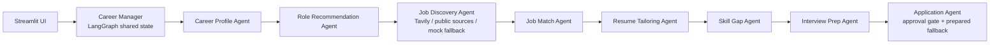

# CareerPilot AI

CareerPilot AI is a competition-ready Streamlit MVP for personalized job discovery. It uses a LangGraph career manager to coordinate specialist agents that turn a resume and preferences into role recommendations, source-agnostic job matches, a tailored resume draft, skill-gap actions, interview prep, and a human-approved application package.

## Run locally

```bash
python -m venv .venv
source .venv/bin/activate       # Windows: .venv\\Scripts\\activate
pip install -r requirements.txt
streamlit run app.py
```

To open the project in VS Code, run `code .` from this folder, or choose **File → Open Folder** in VS Code and select this project directory.

The app works without API keys using clearly labeled scenario data. For live public job discovery, export `TAVILY_API_KEY` before starting Streamlit. Add `OPENAI_API_KEY` to enable personalised profile reasoning, role-fit explanations, and resume tailoring. LinkedIn is not required. Live results are filtered by the selected role and city, normalized into a source-agnostic job schema, and linked back to the public source.

```bash
export TAVILY_API_KEY="tvly-your-key"
export OPENAI_API_KEY="sk-your-key"
python3 -m streamlit run app.py
```

## Architecture



## Agent contract

Every node reads and returns the shared `CareerState`: resume text, preferences, structured profile, recommendations, jobs, match scores, tailored resume, skill gaps, interview prep, application state, an activity log, and an explainable decision trail. The application agent never submits automatically; it prepares materials and requires explicit user approval.

## Demo notes

- Upload PDF, DOCX, or TXT resumes.
- Target-role suggestions are optional: type any role and press Enter to add it.
- If parsing fails, the app still demonstrates the full workflow using preferences and fallback profile skills.
- `MOCK_JOBS` in `app.py` is deliberately source-agnostic and can be replaced with an API adapter.
- No credentials are committed. Keep keys in environment variables.

